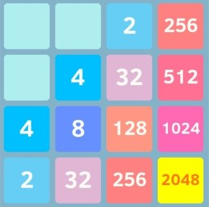
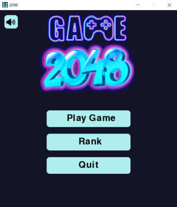

# Game 2048_Python

- Dựa trên trò chơi nổi tiếng 2048 của Gabriele Cirulli. Mục tiêu của trò chơi là trượt các khối được đánh số trên một lưới để kết hợp chúng lại với nhau tạo ra khối 2048.
- đây là phiên bản python sử dụng thư viện pygame

    

# Installation
  
  - chắc chắn rằng bạn đã cài môi trường lập trình python 3 
  - bạn có thể cài đặt pygame bằng pip trên các hệ điều hành windows, Mac và linux:
  
       - $ pip install pygame
       
  - chạy chương trình bằng file run.sh
  - hoặc là chạy với lệnh command python main.py

# Introduction
 - kick chuột vào " play game " để bắt đầu trò chơi.
      + sử dụng các phím mũi tên để di chuyển các khối
      + kick chuột vào biểu tượng  trên màn hình để quay lại màn hình chính
      + kick chuột vào biểu tượng  để thực hiện trò chơi mới
 - kick chuột vào " rank " để xem bảng xếp hạng 
 - kick chuột vào " quit " hoặc dấu "X" để thoát khỏi trò chơi

# Contributors
 
 - AnhJun18 - Lê Phương Anh
 - vyhoang0708 - Lê Hoàng Cẩm Vy

# ScreensHot
 
 
 
 
 